`r sat = read.table("sat.txt",header=TRUE)`
`r tree = read.table("treeVolume.txt",header=TRUE)`

# Exercise 2.1

## Exercise 2.1.a

Step-up method: \
0. selects variable from list of possible predictors and add to baseline model
1. choose the predictor yielding p-value 0.05 and the highest R-squared  \
2. add this variable to the model from the previous iteration to create a new baseline model \
3. remove this variable from the list of possible predictors \
4. return to step 0). \

We can see that "takers" is significant; therefore, we should keep it and check whether the next independent variable is significant. If we add "expend" on top of "takers", the new independent variable is also significant; hence, we keep it. However, when we add "ratio" or "salary" on top of the model with "takers" and "expend", we see that "ratio" is not significant. 

Hence, the final model is "total~takers + expend" with resulting $R^2$ 0.82 and residual standard error 32.46.

```{r,echo=FALSE,results='hide',fig.height=3.5,}
summary(lm(total~takers, data = sat)) 
summary(lm(total~expend, data = sat))
summary(lm(total~ratio, data = sat))
summary(lm(total~salary, data = sat))
#takers yields the largest R2 increase and is significant


summary(lm(total~takers + expend, data = sat))
summary(lm(total~takers + ratio, data = sat)) 
summary(lm(total~takers + salary, data = sat)) 
#expend yields the largest R2 increase and is significant


summary(lm(total~takers + expend + ratio, data = sat))
summary(lm(total~takers + expend + salary, data = sat))
#neither ratio nor salary are significant

```

Step-down method: \
1. Use all of the (remaining) variables as independent variables \
2. For those deemed not significant by the t-test (p-val > 0.05), select variable \ yielding the largest p-value, and remove it from the list of candidate independent  variables. \
3. Go back to step 1. \

We first fit a model with expend, ratio, salary and takers as independent variables. We can see that among the variables with p-values larger than 0.05, ´expend' yields the largest p-value. Thus we remove ít from the list of independent variables. The resulting model summary shows that all remaining independent variables are significant, yielding the following model: "total~ ratio + salary + takers" with resulting $R^2$ 0.82 and residual standard error 32.41.

```{r, echo=FALSE, results='hide'}
model_0 = lm(total ~ expend + ratio + salary + takers , data = sat)
summary(model_0)
#largest p-val> 0.05 is for "expend", remove from model

model_1 = lm(total ~  ratio + salary + takers, data = sat)
summary(model_1)
#all p-values smaller than 0.05, all these variables are significant
```
The step-up and step-down methods yield models with similar $R^2$ and similar residual standard error, with the step-down method yielding a slightly smaller residual standard error. However, the step-down model uses three predictor variables, whereas the step-up model requires only two predictor variables. The small increase of performance does not justify the increase of model complexity; hence, the model obtained with the step-up method is the best; namely: "total~takers + expend"

## Exercise 2.1.b

The relationship between total SAT and the square of takers does not look linear, which suggests that the square of takers may not be a good candidate as a linear predictor.
```{r, echo=FALSE, fig.dim = c(5, 3.5)}

sat$takers2=(sat$takers)^2

plot(sat$total, sat$takers2, main="Distribution of total SAT in terms of the square of takers",
   xlab="Square of takers", ylab="Total SAT", pch=19)

```


```{r, echo=FALSE, results='hide'}
#step-up

summary(lm(total~takers2, data = sat))
summary(lm(total~takers, data = sat)) 
summary(lm(total~expend, data = sat))
summary(lm(total~ratio, data = sat))
summary(lm(total~salary, data = sat))
#takers yields the largest R2 increase and is significant


summary(lm(total~takers + expend, data = sat))
summary(lm(total~takers + ratio, data = sat)) 
summary(lm(total~takers + salary, data = sat)) 
summary(lm(total~takers + takers2, data = sat)) 
#takers2 yields the largest R2 increase and is significant

summary(lm(total~takers + takers2 + expend, data = sat))
summary(lm(total~takers + takers2 + ratio, data = sat))
summary(lm(total~takers + takers2 + salary, data = sat))
#expend yields the largest R2 increase and is significant

summary(lm(total~takers + takers2 + expend + ratio, data = sat))
summary(lm(total~takers + takers2 + expend + salary, data = sat))
#neither ratio nor salary are significant


#best model total~ takers + takers2 + expend, R2 0.8859, standard error 26.08

```

```{r, echo=FALSE, results='hide'}
#step-down
summary(lm(total~takers + takers2 + expend + ratio + salary, data = sat))
#salary largest p-value that is greater than 0.05

summary(lm(total~takers + takers2 + expend + ratio, data = sat))
#ratio largest p-value that is greater than 0.05

summary(lm(total~takers + takers2 + expend, data = sat))
#all other variables are significant


```
The best model resulted in: total~ takers + takers2 + expend yielding an $R^2$ of 0.8859, and a residual standard error 26.08 both for step up and step down methods.

## Exercise 2.1.c

Model from 2.2.b achieves a better performance; hence, we will select this one. Adding the variable "takers" and its square introduces the problem of multicolinearity, which makes the isolation of the effects of each predictor variable and their interpretation impossible. This is because it is impossible to increase one unit of "takers" while forcing "takers2" to be fixed. However, we hypothesize that other powers of "takers" may achieve better results as predictors since neither takers or takers2 seem to be completely linearly related to the total SAT score. \
The R output shows that baseline SAT score is 1052, a SAT score is expected to increase one unit if the mean expenses for a pupil increased by a factor of 8 approximately. 

```{r}
model_2_1_c <- lm(total~takers + takers2 + expend, data = sat)
model_2_1_c$coef
```

## Exercise 2.1.d
```{r, echo=FALSE, results='hide'}
best_model <- lm(total ~ takers + takers2 + expend, data = sat)
t = 25
t2 = 25^2
newdata = data.frame("takers" = t, "takers2" = t2, "expend" = 5)
predict(best_model,newdata = newdata, interval = "prediction")
predict(best_model, newdata= newdata, interval = "confidence") 
```
Prediction: 961.570 \
Prediction interval: [907.600, 1015.54] \
Confidence interval: [949.080, 974.061] \

# Exercise 2.2
## Exercise 2.2.a
H0: tree type has no effect on volume \
H1: contribution level of beech $\alpha 1$ contribution level of oak $\alpha 2$

p-value = 0.17 > 0.05 => can't reject H0; hence, tree type does not seem to have a significant effect on the tree volume; therefore, we cannot say that an oak is more voluminous than a beech at a 0.05 significance level. However, the predicted volume for a beech is 30.171 while it is 35.25 for oaks. The volume can be calculated using the function predict, or by looking at the intercept for the baseline Beech volume, and the sum of the intercept and type oak coefficients returned by the summary of the fitted model.
```{r, echo=FALSE, results='hide'}
volumelm = lm(volume ~ type,data=tree)
anova(volumelm)
summary(volumelm)

newdata = data.frame("type" = "beech")
predict(volumelm, newdata = newdata)

newdata2 = data.frame("type" = "oak")
predict(volumelm, newdata = newdata2)
``` 

## Exercise 2.2.b

H0: Tree type has no effect on tree volume given the tree diameter and height

H1: Tree type has an effect on tree volume given the tree diameter and height

Since we want to test if tree type has an effect on volume, type goes last in lm command.

```{r, echo=FALSE,results='hide'}
volumelm_ancova=lm(volume~height+diameter+type, data=tree)
anova(volumelm_ancova)
summary(volumelm_ancova)

avg_height = mean(tree$height)
avg_diam = mean(tree$diameter)

newbeech = data.frame("type" = "beech", "height" = avg_height, "diameter" = avg_diam)
newoak = data.frame("type" = "oak", "height" = avg_height, "diameter" = avg_diam)
predict(volumelm_ancova, newdata = newbeech)
predict(volumelm_ancova, newdata = newoak)
```
p-value = 0.143 > 0.05 => can't reject H0; hence, tree type does not seem to have a significant effect on the tree volume given the height and diameter. Given two trees with overall average height and diameter, the volume of a beech is predicted to be 33.200, and for an oak it is predicted to be 31.896.

To calculate the effect of diameter on volume we use linear regression and check whether diameter is significant.

```{r,results='hide'}
volume_diam=lm(volume~diameter, data=tree)
summary(volume_diam)

```
We can see that the coefficient for diameter is 4.885 and that diameter is deemed as a significant predictor. Hence, an increase of one unit of diameter yields a volume increase by a factor of 4.885. To see whether this effect is similar for both tree types we can plot the tree volume against the tree diameter and colour the points by tree type. In this scatter plot we cannot clearly identify two clusters of points for each data type, and volume seems to increase with the diameter independently of the tree type; hence, the dependence of volume on the tree diameter seems to be similar for both tree types.

```{r,echo=FALSE,fig.dim=c(5,3.5)}
plot(tree$diameter,tree$volume,col=factor(tree$type,labels=c("blue","red")))

```

## Exercise 2.2.c

Since a tree can be seen as cylinder, we can estimate its volume by $\pi * radius^2 * height$. The radius is the diameter multiplied by 0.5; therefore, the relationship between $diameter^2$ and the volume should also be significant. 

The first option would be to square the diameter and add it as a predictor together with the height. The second option is to include the product of the square of the diameter and the tree height, note that this model is still considered linear in the regression coefficients. 


```{r, results='hide'}
tree$diameter2 = tree$diameter ^2
tree$product = tree$diameter2*tree$height

summary(lm(tree$volume ~ tree$diameter2 + tree$height))
summary(lm(tree$volume ~ tree$product))

```

Note that both of these models achieve a better performance than the model including the non-transformed height and diameter variables and the tree type, and the model including only the tree diameter. Amongst these two models, the model using the product of the height and the square of the tree diameter as predictors achieves the highest $R^2$ and the smallest residual standard error. 

# Exercise 2.3
## Exercise 2.3.a

The decision variables for this optimization problem are defined as quantities of the following products:

$x_1 = Carrots; x_2 = Potatos; x_3 = Bread; x_4 = Cheese; x_5 = PeanutButter$

Each product has the corresponding nutritional values: $calories_i; fat_i; protein_i; carbs_i$
These nutritional values are used to define the decision variables below:

1. $(\sum_{i=1}^{n=5} calories_i*x_i ) \geq 2000$
2. $(\sum_{i=1}^{n=5} fat_i*x_i )  \geq 50$
3. $(\sum_{i=1}^{n=5} protein_i*x_i )  \geq 250$
4. $(\sum_{i=1}^{n=5} carbs_i*x_i)  \geq 200$


Objective is to minimize the prize:

$min(\sum_{i=1}^{n=5} price_i*x_i)$

The cheapest diet that fulfills these constraints consists out of $7.72$ servings of potatoes and $9.28$ servings of peanut butter, and has a prize of $2.32$ per serving.

## Exercise 2.3.b
Increasing the price of peanut butter to 0.25cents after 5 quantities can be formulated as a peanut butter tax of 0.10cents. 
For that, we first add a binary constraint to the problem definition:

$y = \begin{cases} 1 &\text{ if } x_5 > 5 \\ 0 &\text{ else}  \end{cases}$

And the objective incorporates binary variable $y$ to add a peanut butter tax to the calculation as follows:

$min((\sum_{i=1}^{n=5} price_i*x_i) + 0.1 y(x_5-5))$

Solving this problem in Excel, yields the result that peanut butter is used $5$ times and potatoes $16.62$ times in the cheapest diet that fulfills all nutritional constraints and will costs $2.75$€ per serving. Here we can see, that peanut butter does not become a profitable item once the peanut butter tax has been introduced, but the price increases nevertheless by $0.43$ cents due to the increased use of potatoes in the diet.

## Exercise 2.3.c

Using an ILO model, we add the constraint of using no fractions when calculating the cheapest diet to the existing constraints from 2.3.a. \\
The cheapest diet consists out of $9$ servings of potatoes and $9$ servings of peanut butter, and has a prize of $2.43$ per serving. More potatos are now required to compensate for the rounded down amount of peanut butter servings.

# Exercise 2.4
## Exercise 2.4.a

The transportation problem was solved using a LO Model. The cheapest transportation plan that fulfills all demand and respects available supplies costs 460€

Constraints are defined as:

1. $x_{11} + x_{12} + x_{13} + x_{14} \leq 20$
1. $x_{21} + x_{22} + x_{23} + x_{24} \leq 25$
1. $x_{31} + x_{32} + x_{33} + x_{34} \leq 15$
1. $x_{11} + x_{21} + x_{31} \geq 10$
1. $x_{12} + x_{22} + x_{32} \geq 15$
1. $x_{13} + x_{23} + x_{33} \geq 15$
1. $x_{14} + x_{24} + x_{34} \geq 20$
1. $x_{ij} \geq 0, i = 1,2,3, j = 1,2,3,4$

Objective is to find the cheapest transportation plan, such that:

$min (10 x_{11} + 0x{12} + 20x{13} + 11x{14} \\ + 12x{21} + 7x{22} + 9x{23} + 20x{24} \\ + 0x{31} + 14x{32} + 16x{33} + 18x{34})$

or 

$min \displaystyle\sum_{i=1}^{n=3} \displaystyle\sum_{j=1}^{m=4} Cost_{ij}* x_{ij}$

TODO add quantities (from Solver Report or so)

## Exercise 2.4.b
Each transportation edge has an initial cost of 100. 

For this we will use the same constraints as in 2.4.a plus a decision contraint:

$$
y_{ij} = 
\begin{cases} 
  1 &\text{if } x_{ij} > 0\\
  0 &\text{else } 
\end{cases}
$$

The objective stays also the same but also incorporates the additional cost for transporting goods from a source to a destination.

$min \displaystyle\sum_{i=1}^{n=3} \displaystyle\sum_{j=1}^{m=4} Cost_{ij} x_{ij} + 100y_{ij}$

where $y_{ij}$ is a binary decision variable whether edge $x_{ij}$ has been used or not and adds the additional cost respectively.

With these fixed costs, the cheapest price for the transportation of all goods to the requested destinations is 995€. In this solution 5 routes are being used, one less then in the previous excersize.

# Exercise 2.5
## Exercise 2.5.a
To find the cheapest solution to this personal scheduling problem, an ILO model was used. The ILO model is de the best model to use because there can't be any half-employees. After running the excel optimization solver, the cheapest schedule would be 3,296.00 euros. The objective and constraint can be found below. The full excel sheet can be found in the Appendix. Here it can be seen when the shift needs to start and at what time.

__Outline of the ILO model:__ \

2 types of shifts: \
* 4-hour, 24 euro per hour (96 euro total) \
* 8-hour (not inlcluding break of 0.5 hour), 20 euro per hour (160 euro total)

__Objective:__ (minimize the costs) \
number of 4 hour shifts = z \
number of 8 hour shifts = y \
min($\sum_{u=1}^{24}z_u * 96$ - $\sum_{u=1}^{24}y_u * 160$)

__Decision variable:__ \
x~i~ = number of staffers (4 or 8 hour shift) per half hour \

__Constraints:__
The number of worker had to be Scheduled~u~ >= Required~u~ \
i = 1, 2, ..., 25 \
u = 1, 2, ..., 24 \
$x \in 0, 1, 2, ...$

## Exercise 2.5.b

In the new problem, two things changed compared to the previous problem. First, now there were only 8-hour shifts. Second, the "required staffing" is now "demanded staffing", suggesting that it is not necessarily to be fulfilled anymore. This changed the layout of the excel sheet together with several constraints. The outcome of this problem for the minimized difference between demanded and scheduled staffing came down to 109. The excel sheet is displayed in the Appendix; the ILO model is presented below.

__Objective:__ (minimizes the sum of absolute differences between the demanded and scheduled staffing) \
demanded staffing = z, scheduled staffing = y.

min($\sum_{u=1}^{24}z_u$ - $\sum_{u=1}^{24}y_u$)

__Decision variable:__ \
x~i~ = number of scheduled staffing per half hour. Earliest start 9:00 latest start 12:30.

__Constraints:__ \
The number of Scheduled workers had to be smaller or equal than the Demanded workers:\
workers had to be Scheduled~u~ <= Demanded~u~ \
i = 1, 2, ..., 8 \
u = 1, 2, ..., 24 \
$x \in 0, 1, 2, ...$

\newpage

# Appendix

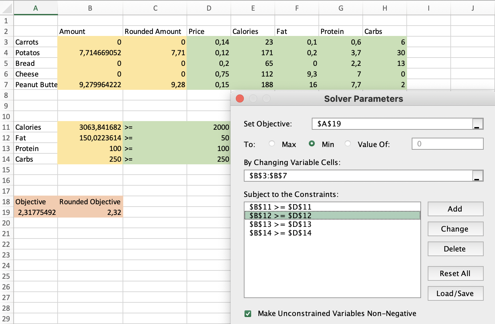

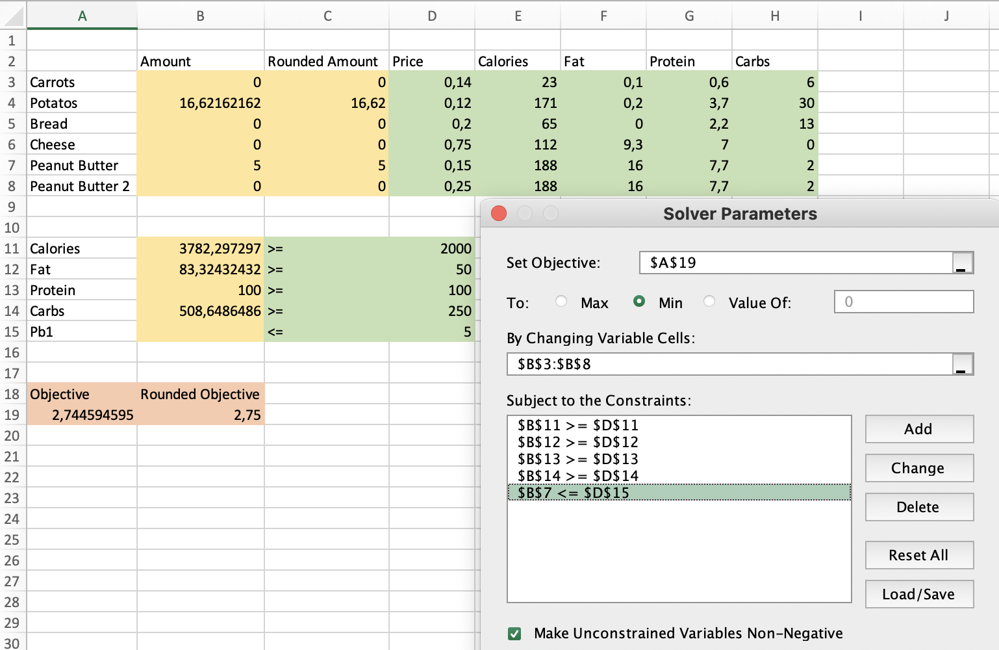

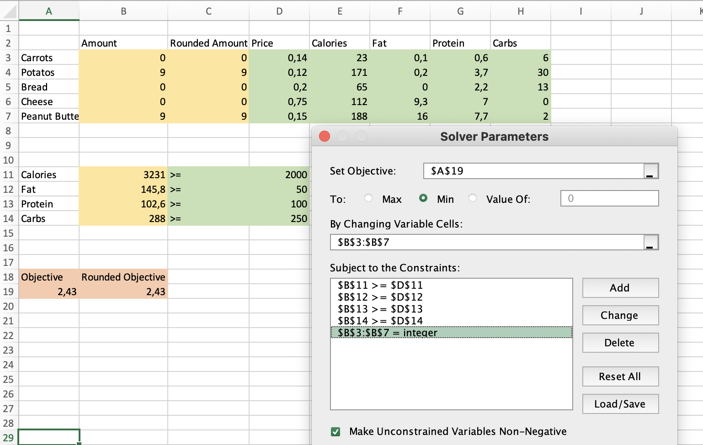


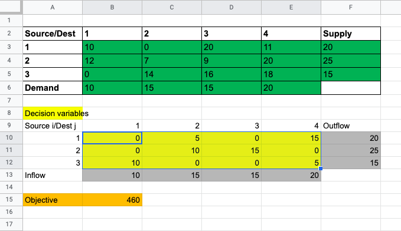

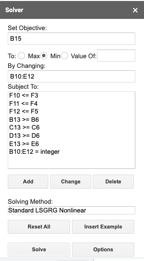{width="35%"}

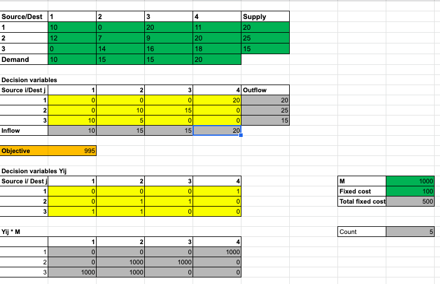

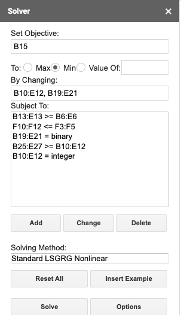{width="35%"}

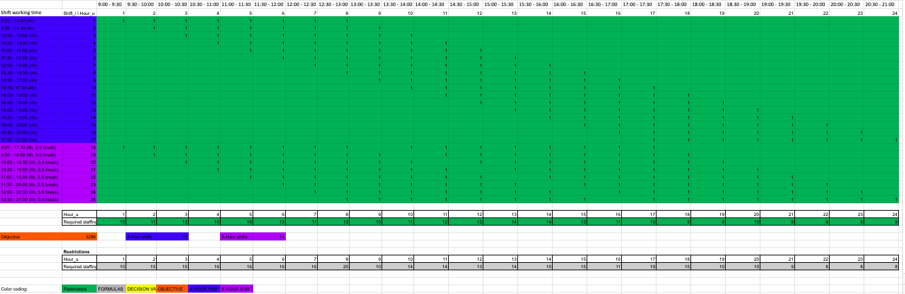

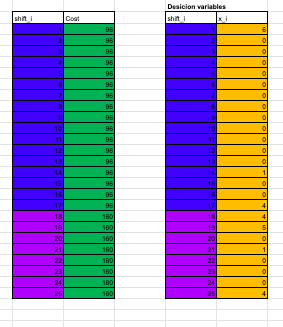

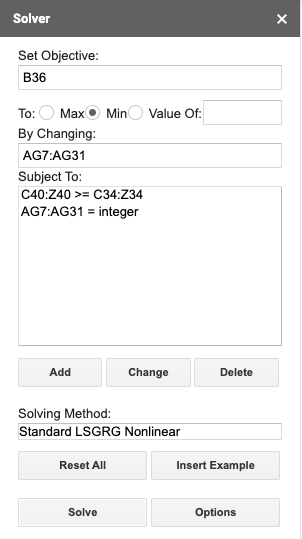{width="35%"}

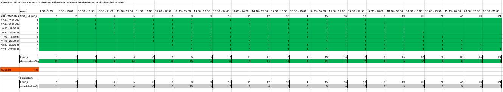

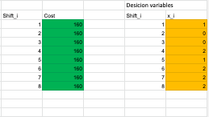

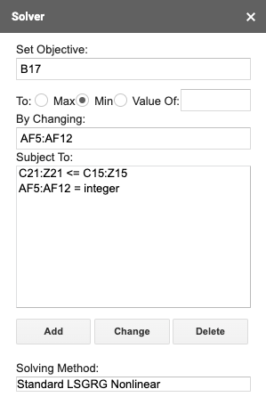{width="35%"}


