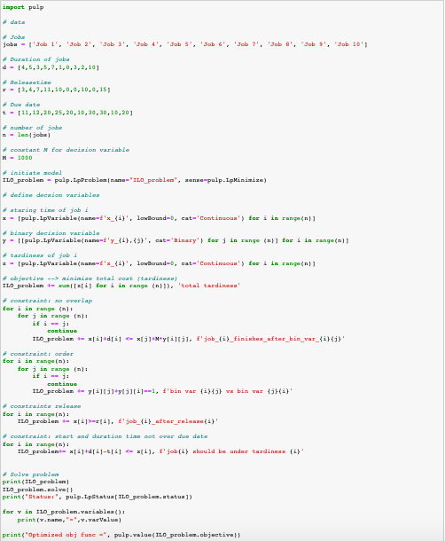
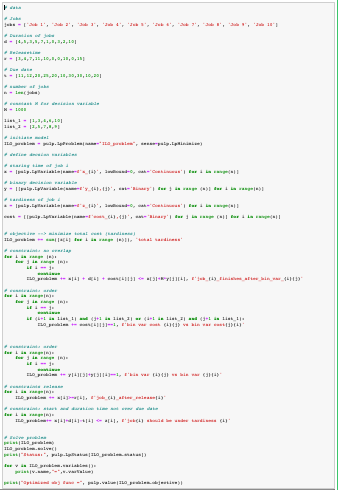

# Statistics, Simulation & Optimization: Assignment 3

## 3.1 Single-Machine Scheduling

### 3.1 A
To solve this single-machine scheduling problem, an integer linear optimization model was created by using PULP. With this model, the most optimal solution was found to complete all ten jobs with the least amount of tardiness. The model has the following decision variables. 

* jobs: the names of jobs available
* d_i: duration of a certain job
* r_i: release time of a certain job in hours
* t_i: due date of a certain job
* n: number of jobs
* y_i_j: decision variable, with y_i_j = 1 if job i goes before before job j
* z_i: tardiness of each job

The model also made use of the following constraints.

1. No overlap: 
  x~i~ + d~i~ <= x~j~ + 1000 * y~i,j~ (for each i, j. As long i is not j)
2. Job order: 
  y~i,j~ + y~j,i~ = 1 (for each i, j. As long i is not j)
3. release date: 
  x~i~ >= r~i~ (for each i)
4. Start and duration times not greater than the due date (tardiness):
  x~i~ + d~i~ - t~i~ <= z~i~, z~i~~ >= 0 (for each i)
5. Binary decision variable:
  $y_{i,j} \in 0,1$, (for all i and j. As long i is not j)

i and j are the number of jobs with a possible integer value of 1 to 10. 

To calculate the optimal solution to this problem:
$$\sum_{n=1}^{10} c_i * z_i$$
Here c~i~ is 1, and z~i~ is the tardiness of a job.

After running the model, this gave the following optimal schedule:

| Job order       | 6 | 7 | 9 | 1 | 2 | 3  | 5  | 4  | 8  | 10 |
|-----------------|---|---|---|---|---|----|----|----|----|----|
| Start time (x_i) | 0 | 1 | 1 | 3 | 7 | 12 | 15 | 22 | 27 | 30 |
| Tardiness (z_i)  | 0 | 0 | 0 | 0 | 0 | 0  | 2  | 2  | 0  | 20 |

In this schedule, we start with job 6 and end with job 10. Tasks 5, 4, and 10 will have tardiness with a total of 24 hours. This means that the optimal schedule the machines need an extra 24 hours in order to complete all the jobs.

### 3.1 B
Compared to the problem in exercise, a few things need to change to model the optimal solution. Now Jobs 1, 3, 4, 6, and 10 require a sieve of type 1, whereas jobs 2, 5, 7, 8, and 9 require a sieve of type 2. When jobs come after each other with a different sieve, the extra time it costs to change the sieve is 1 hour. The constraints in this problem were modified with an extra binary decision variable: costs~i,j~. This variable will be 1 if the jobs require a different sieve. Moreover, the constraint of preventing overlap was modified to implement the cost variable correctly. The new no-overlap constraint is now:
$$x_{i} + d_{i} + cost_{i} <= x{j} + 1000 * y_{i.j}$$
With this new constraint, the 1 hour of extra time will be added if jobs x~i~ and x~j~ are not in the same groups. This gave a result of a total tardiness of 40 hours. The table with the optimal schedule is presented below:

| Job order       | 9 | 7 | 6 | 1 | 3 | 2  | 5  | 8  | 4  | 10 |
|-----------------|---|---|---|---|---|----|----|----|----|----|
| Start time (xi) | 0 | 2 | 3 | 4 | 8 | 12 | 17 | 24 | 28 | 33 |
| Tardiness (zi)  | 0 | 0 | 0 | 0 | 0 | 5  | 4  | 0  | 8  | 23 |

Compared to the previous schedule, we see a different order and a delay for the following jobs: 6, 2, 4. This means there will be a change of sieve three times. This has changed the order of the most optimized solution and brings 16 additional hours compared to the first schedule without the extra costs of sieve change.

## 3.2 Project Planning

### Exercise 3.2.a

The project consists out of 7 activities (1,2,3,4,5,6,7) which all have a respective expected duration $d_i = [1,3,2,3,4,5,2], i \in [1,2,3,4,5,6,7]$ 

Their finish times $FT_i$ are formulated according to the dependencies depicted in the assignment description as follows:

1. $FT_1 = d_1$
1. $FT_2 = d_1 + d_2$
1. $FT_3 = d_1 + d_3$
1. $FT_4 = d_1  + d_4$
1. $FT_5 = max(d_2,d_3) + d_5$
1. $FT_6 = max(d_3 + d_4) + d_6$
1. $FT_7 = max(d_5, d_6) + d_7$

The activity durations follow an exponential distribution $r(x) = e^{-d_ix}$ and therefore the function  $x = \frac{-ln(u)}{\frac{1}{d_i}}$ was used to simulate new values for each activity, where $u$ is a random sample from a uniform distribution.

This was done 10,000 times in Excel, and the sample average (expected project finish time) was 14.081.

### Exercise 3.2.b

Next, we calculate a 95% confidence interval using the sample standard deviation of 6.167, the z-score of 1.96, and the sample size of 10,000.

We can say with 95% confidence that the expected finish time lies between the lower and upper bounds of [13.85, 14.09]

### Exercise 3.2.c

The probability that the project takes more than 12 days can be represented as a sample proportion $p$. Therefore we count the occurrences where the finishing time is greater than 12 in our 10,000 samples and divide that by the total number of samples.

Doing so, the sample proportion is 0.581.

Knowing the sample proportion, we can construct the 95% confidence interval using the sample standard deviation of 0.494, the z-score of 1.96, and the sample size of 10,000.

With 95% confidence, we can say that the probability for the expected finishing time to be greater than 12 is between the lower and upper bounds of [0.571, 0,591].

## 3.3 Optimal Hotel Prizes

### 3.3 A

### 3.3 B

## Appendix

